University: ITMO University
Faculty: FICT
Course: Network Functions Virtualization
Year: 2026/2027
Group: K3$21
Author: Stafeev Ivan Alekseevich
Lab: Lab1
Date of create: 22.09.2026
Date of finished: 23.00.2026

# Лабораторная работа №1. Установка GNS3 и базовая настройка

**Цель работы:** ознакомиться с виртуальным лабораторным стендом GNS3, научиться устанавливать и настраивать GNS3 на рабочем компьютере для дальнейшей работы над сетевыми проектами, а также подготовить рабочую среду.

Для достижения цели были поставлены следующие задачи:
1. Установить и подготовить среду моделирования `GNS3` на рабочей станции.
2. Настроить взаимодействие GNS3 с виртуальной машиной GNS3 VM и гипервизором VirtualBox.
3. Проверить работоспособность эмулятора QEMU и возможность запуска виртуальных сетевых устройств.
4. Добавить и настроить образ сетевой операционной системы `SONiC` и добавить дополнительные образы.
5. Создать тестовую топологию и проверить сетевое взаимодействие между узлами.

---

# 1. Установка GNS3 и GNS3 VM

В качестве хоста использовалась система под Ubuntu 22.04. Для установки GNS3 сначала был добавлен репозиторий командой `sudo add-apt-repository ppa:gns3/ppa`, потом была произведена установка командой `sudo apt install gns3-gui gns3-server` (выполнение двух команд в консоли можно увидеть на рисунках 1 и 2).

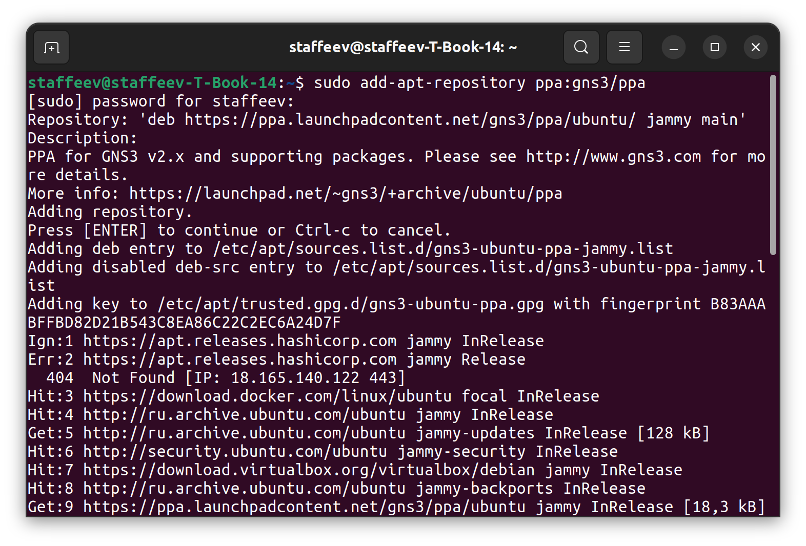

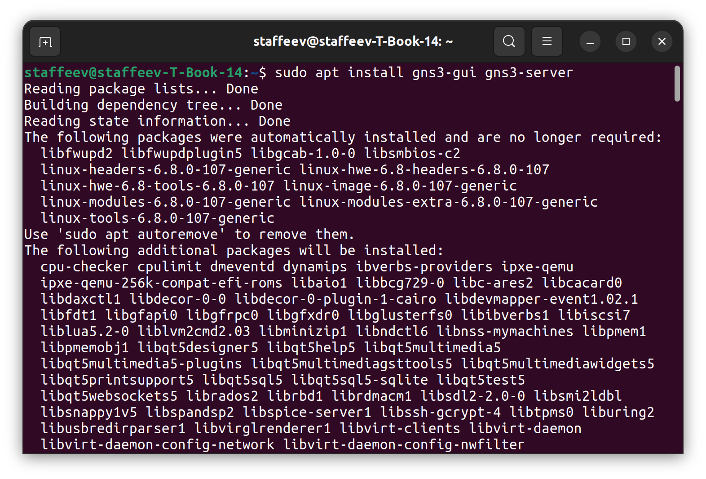

Затем были проверены версии требуемых компонент для работы: GNS3, VirtualBox, QEMU, Dynamips (рисунок 3). Нужное ПО установлено.

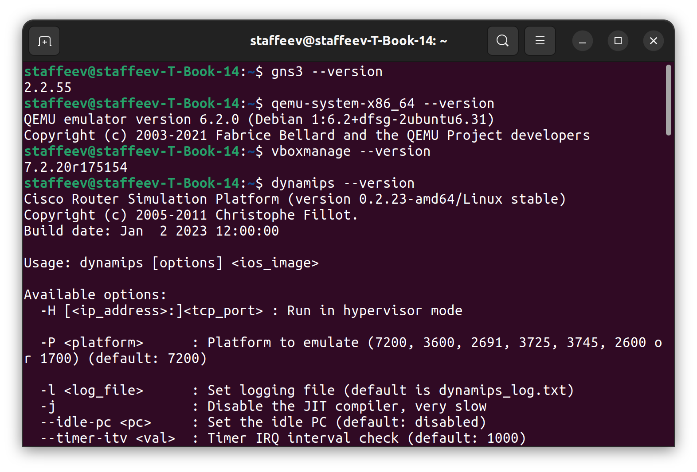

Для корректной работы с виртуальной машиной под GNS3 требуется совпадение версий GNS3 и GNS3 VM. Образ виртуальной машины для версии 2.2.55 был скачан с официального [репозитория](https://github.com/GNS3/gns3-gui/releases?page=2#release-v2.2.55) GNS3.

Для построения виртуальной сетевой лаборатории была установлена система моделирования `GNS3` версии 2.2.55. Для запуска виртуальных устройств использовалась виртуальная машина `GNS3 VM`, работающая в среде виртуализации `VirtualBox`. В среде виртуализации VirtualBox скачанная ВМ была добавлена как Appliance (рисунок 4).

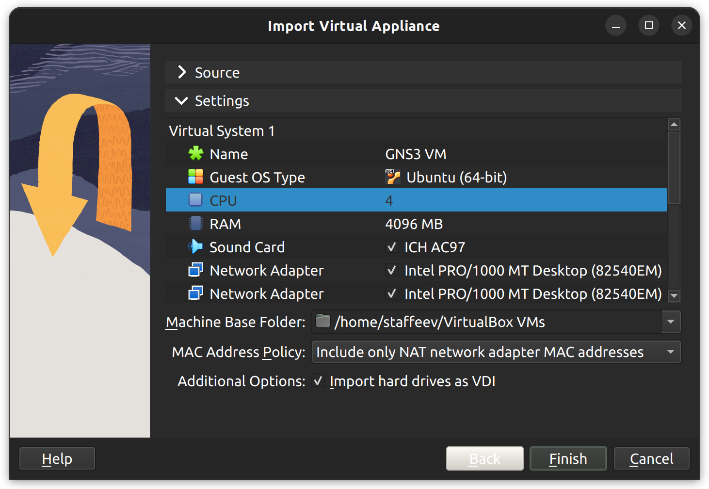

При первом запуске GNS3 нужно было выбрать способ запуска appliance'ов. Была выбрана уже установленная GNS3 VM (рисунок 5).

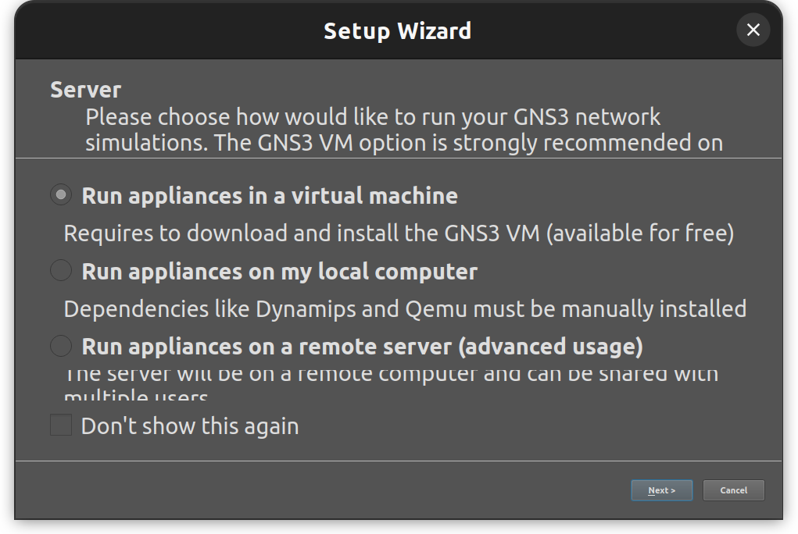

На следующем шаге добавленная ранее в VirtualBox ВМ автоматически добавилась в GNS3 (рисунок 6). Среда виртуализации выбрана VirtualBox.

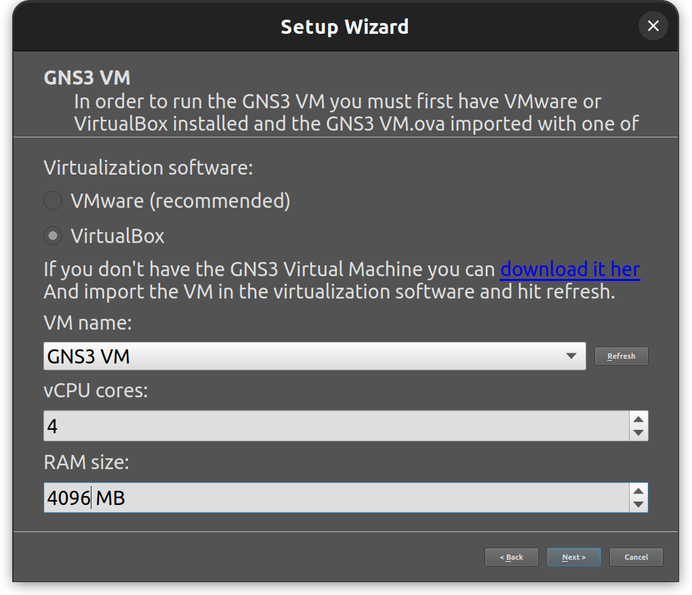

В результате ВМ корректно добавилась как способ запуска виртуальных устройств, что можно увидеть на рисунке 7.

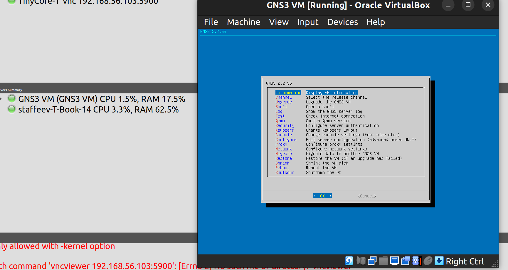

Последним этапом подготовки рабочей среды стало изменение адреса GNS3-Server с localhost на адрес Host-Only адаптера VirtualBox (`192.168.56.1`), что показано на рисунке 8.

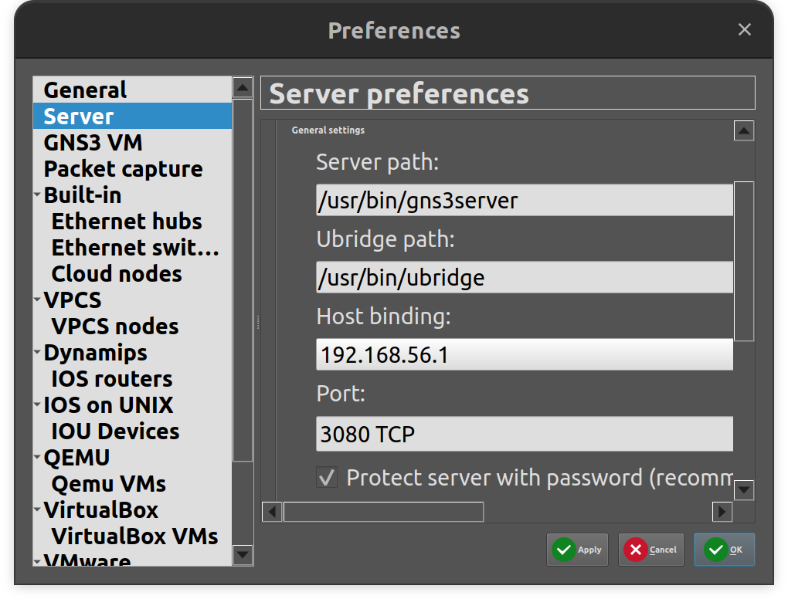

Теперь рабочая среда GNS3 настроена, можно переходить к созданию образа SONiC и созданию тестового проекта.

---

# 2. Установка и настройка SONiC

С [сайта с релизами SONiC](https://sonic-build.azurewebsites.net/ui/sonic/pipelines/142/builds/1226298/artifacts/1423921?branchName=202411&artifactName=sonic-buildimage.vs) был скачан образ сетевой операционной системы для виртуального коммутатора `sonic-vs.img.gz` (рисунок 9). Был выбран последний успешный билд на дату выполнения лабораторной работы.

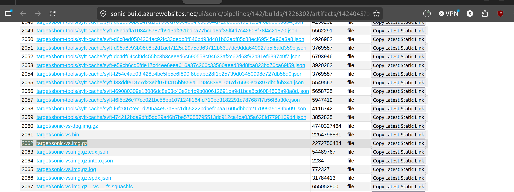

Скачанный образ был добавлен в качестве QEMU-виртуальной машины в настройках GNS3 (рисунок 10). В настройках была задана соответствующая конфигурация, в качестве дискового образа использовался скачанный файл `sonic-vs.img`. В разделе QEMU Binary был выбран бинарник `qemu-system-x86_64`.

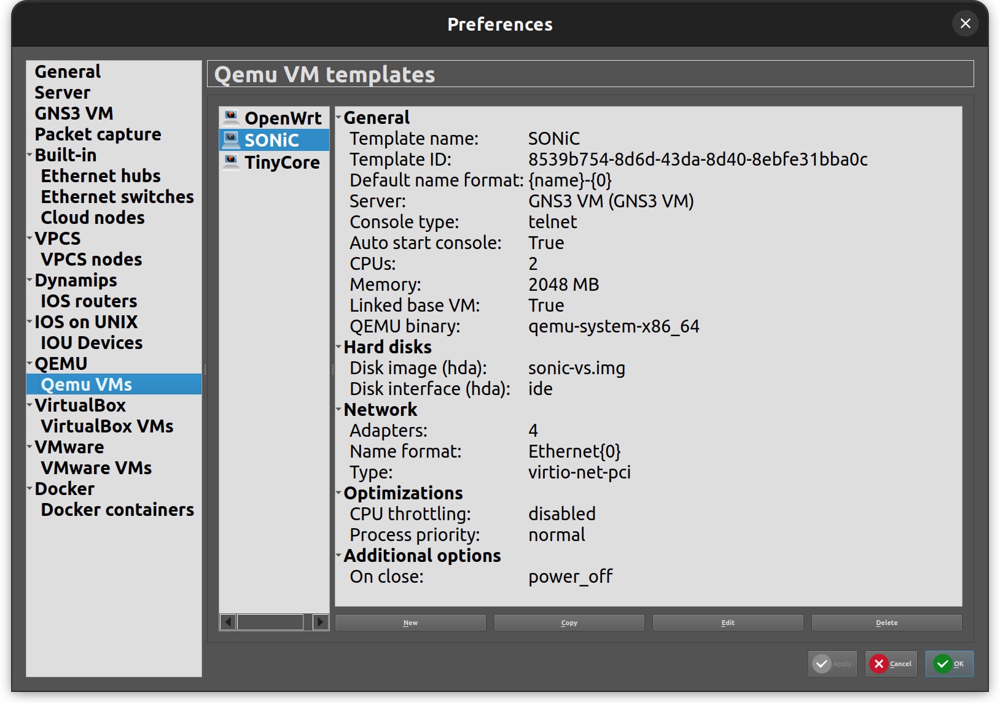

При первом запуске виртуального устройства с SONiC возникла ошибка Guru Meditation с GNS3 VM (рисунок 11).

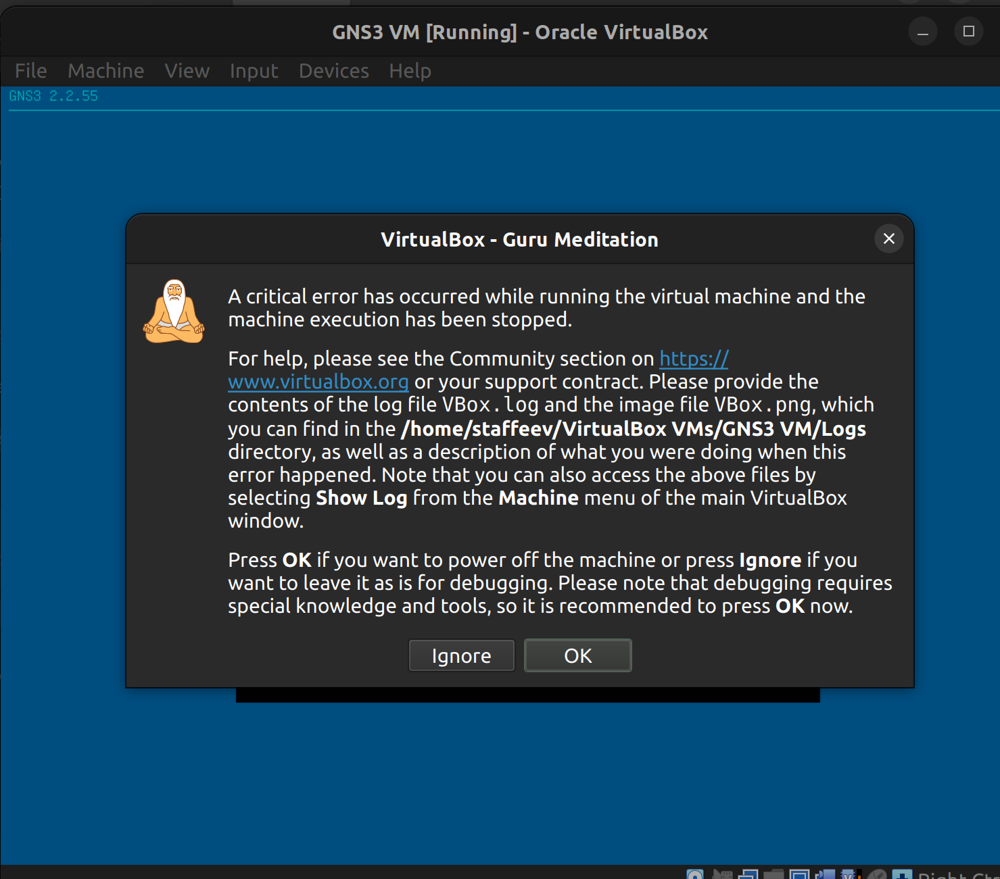

В ходе чтения логов и форумов, посвященных этой проблеме, выяснилось, что вероятная причина ошибки — недостаток ресурсов для нормальной работы QEMU-виртуальной машины внутри виртуальной машины GNS3. Проблема решилась, когда для SONiC были сокращены используемые ресурсы (vCPU и RAM), а для GNS3 VM они были увеличены. Также был увеличен объем видеопамяти до 128 МБ. Помимо этого, через команду `sudo systemctl stop docker` была остановлена служба Docker, которая на хостовом устройстве была всегда активна.

Помимо SONiC, добавлены дополнительные сетевые узлы. В качестве Linux-системы был добавлен образ `Tiny Core Linux 17.1` (работоспособность можно посмотреть на рисунке 12). Также было добавлено устройство на базе `OpenWrt 25.12.0`, его запуск показан на рисунке 13. Оба устройства добавлены как QEMU-виртуальные машины.

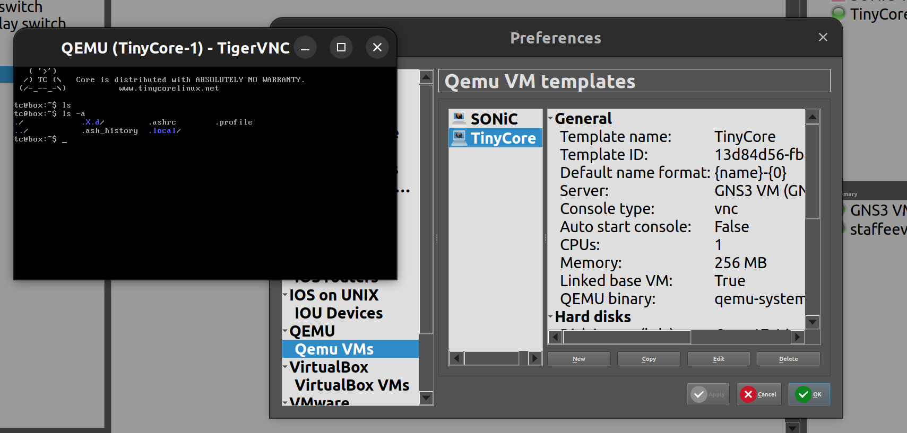

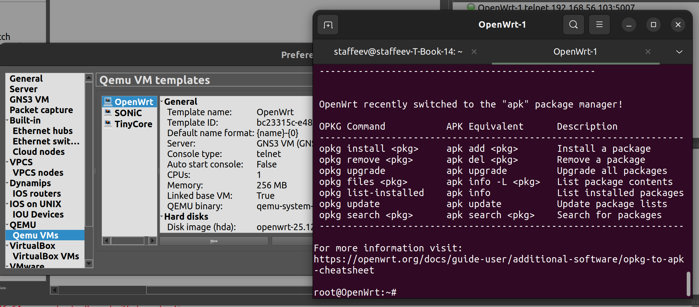

---

# 3. Создание тестовой конфигурации сети

Для проверки работоспособности настроенной среды была создана тестовая топология, состоящая из двух виртуальных рабочих станций `VPCS` и маршрутизатора `SONiC`: `VPCS1` <-> `SONiC` <-> `VPCS2`. Устройства в среде GNS3 показаны на рисунке 14. Устройства TinyCore и OpenWrt добавлены только для теста работоспособности и в схеме сети не участвуют.

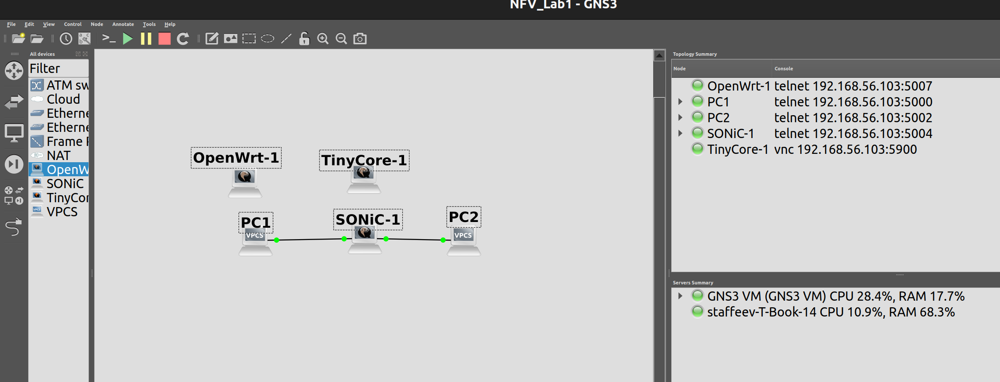

Для первого сетевого сегмента использовалась сеть `192.168.10.0/24` (интерфейсу SONiC eth0 задан адрес `192.168.10.1`, у VPCS — `192.168.10.10`). Для второго сетевого сегмента использована сеть `192.168.20.0/24` (адреса заданы по аналогии). Задание адресов на SONiC и поднятие интерфейсов показано на рисунке 15.

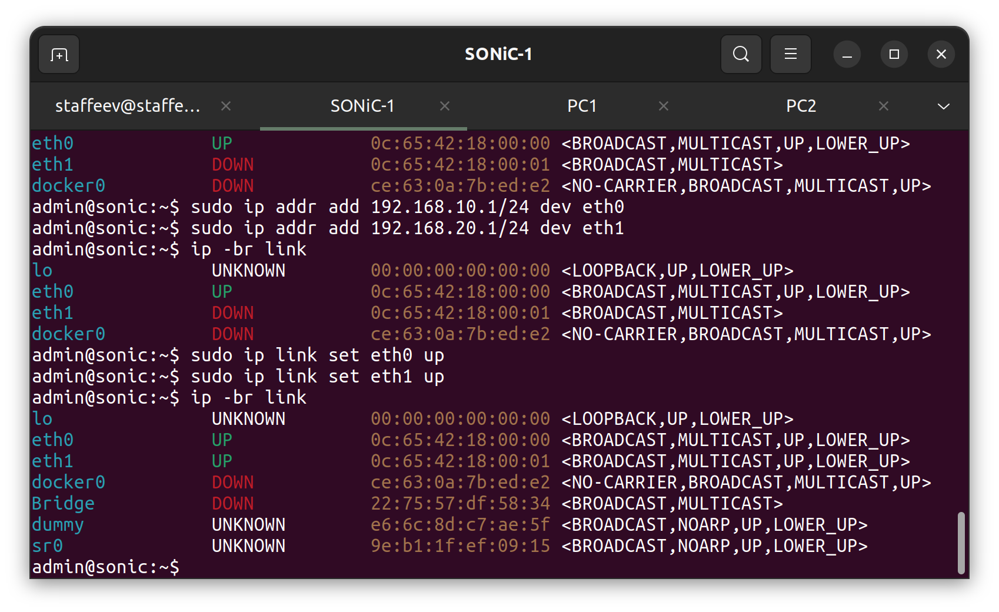

Маршруты в созданные подсети появились на устройстве с SONiC, что продемонстрировано на рисунке 16.

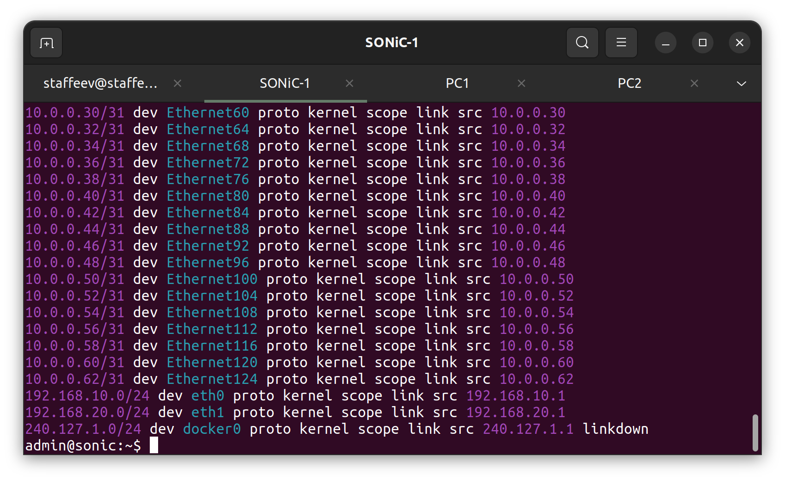

На одном из интерфейсов почему-то была отключена опция ip-forwarding. Через `echo` в конфигурационный файл эта опция была включена (рисунок 17).

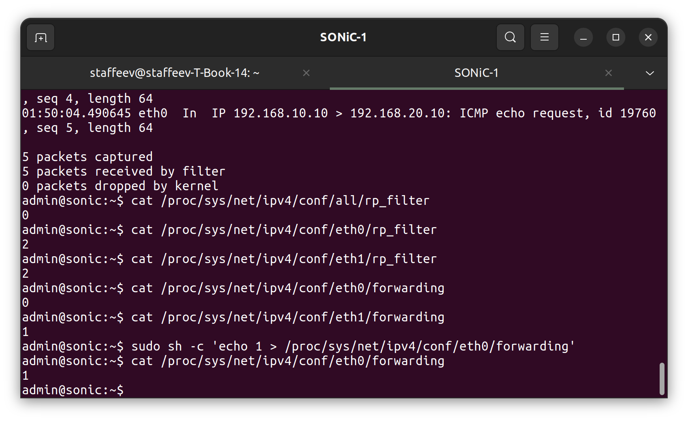

В результате связность в сети настроена корректно. Два VPCS могут пинговать друг друга, что можно увидеть на рисунке 18.

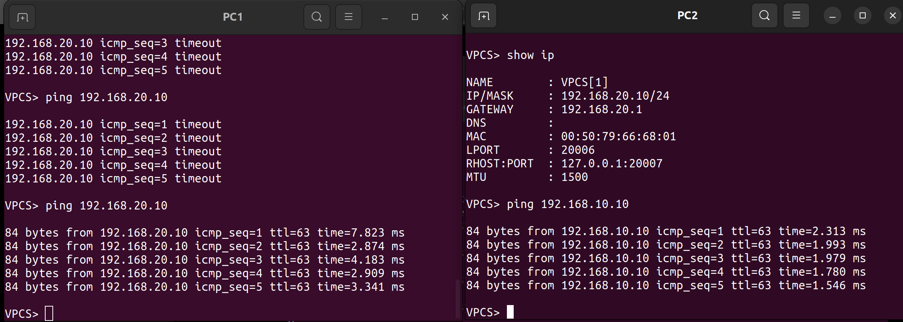

---

# 4. Выводы

В процессе выполнения лабораторной работы были освоены основные принципы установки и настройки GNS3, а также взаимодействия GNS3 с виртуальной машиной GNS3 VM, VirtualBox и QEMU. Была подготовлена виртуальная среда для запуска сетевых операционных систем, установлен и настроен образ SONiC. На основе SONiC была создана тестовая сеть из двух подсетей. После настройки IP-адресации и IP-пересылки была успешно проверена передача ICMP-пакетов между виртуальными рабочими станциями, расположенными в разных сетевых сегментах. Цель работы выполнена.