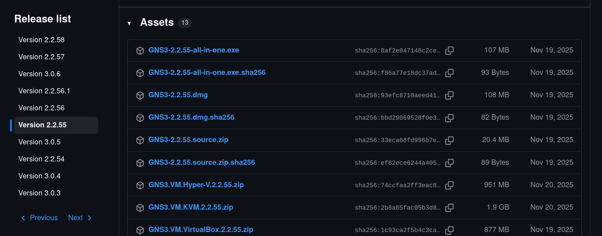
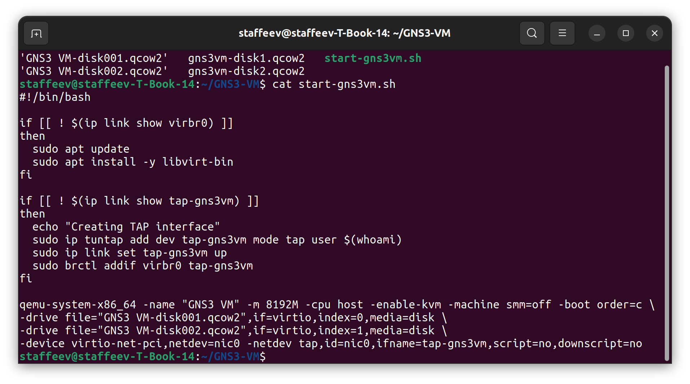
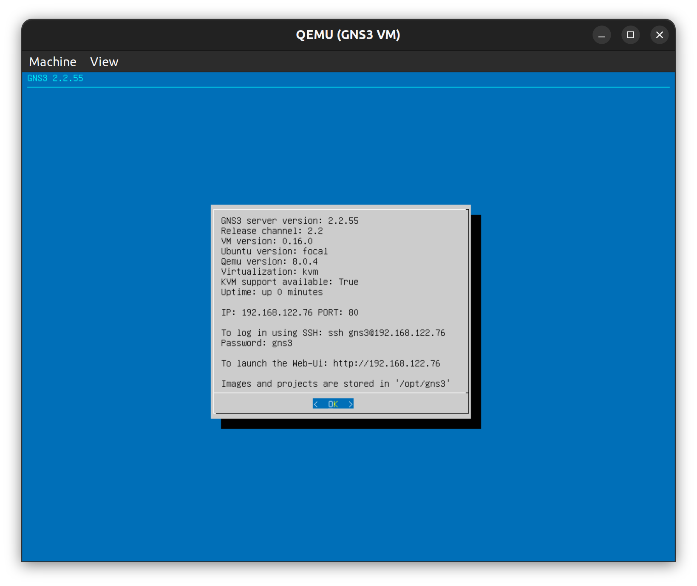
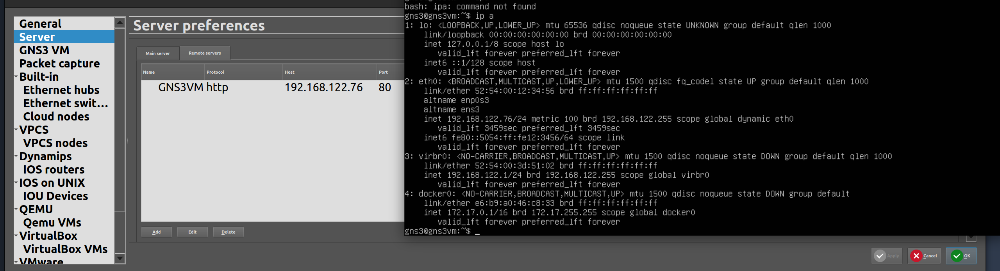
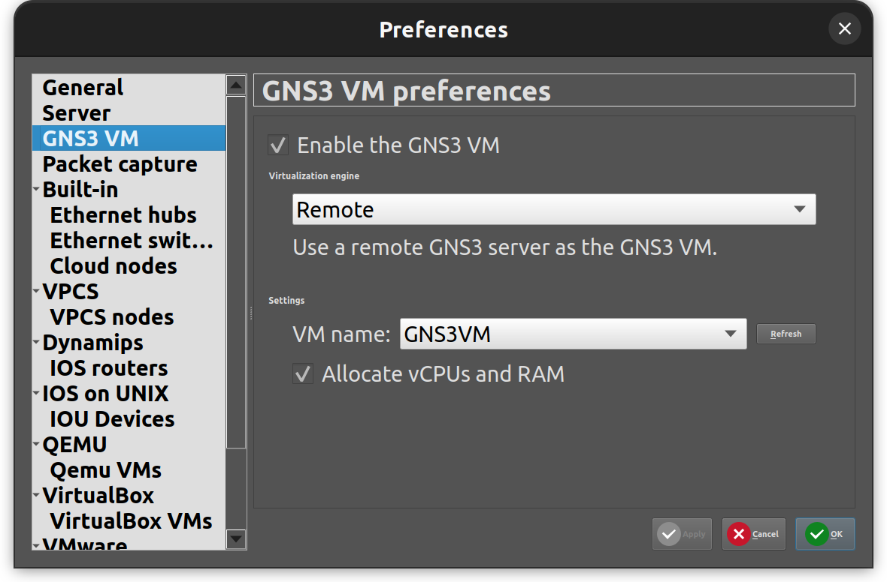
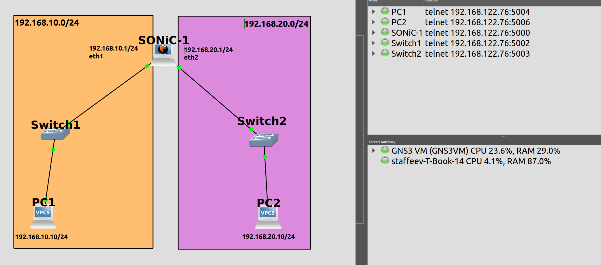
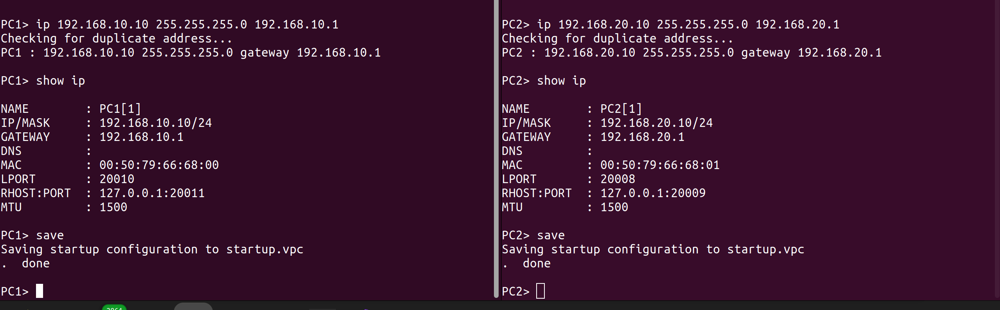
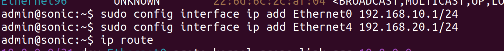
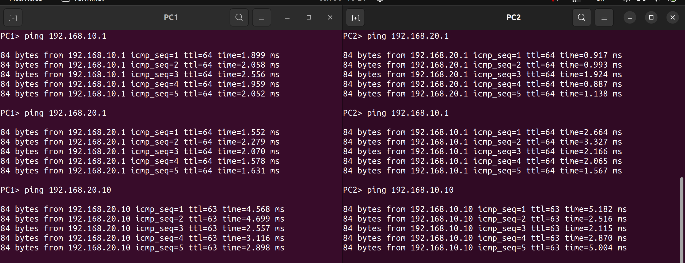

University: ITMO University 
Faculty: FICT 
Course: Network Functions Virtualization 
Year: 2026/2027 
Group: K3421 
Author: Stafeev Ivan Alekseevich 
Lab: Lab2 
Date of create: 01.10.2026 
Date of finished: 01.10.2026 

# Лабораторная работа №2. Настройка маршрутизатора SONiC в GNS3 и построение простой сети

**Цель работы:** ознакомиться с базовой конфигурацией маршрутизатора на основе сетевой операционной системы `SONiC`, создать в среде эмуляции `GNS3` тестовую сетевую топологию и настроить базовую маршрутизацию для обеспечения корректного взаимодействия узлов в разных сетевых сегментах.

Для достижения цели были поставлены следующие задачи:
1. Создать тестовую топологию, включающую один маршрутизатор `SONiC`, два сетевых коммутатора и два хоста.
2. Выполнить первичную настройку IP-адресации на интерфейсах маршрутизатора и на сетевых интерфейсах конечных хостов.
3. Проверить корректность формирования таблицы маршрутизации на стороне `SONiC` и обеспечить работу механизма IP-пересылки.
4. Протестировать сетевую связность путем отправки ICMP-запросов между хостами.

---

# 1. Исправление ошибок с предыдущей работы

При выполнении предыдущей лабораторной работы неоднократно возникала ошибка Guru Meditation в среде виртуализации VirtualBox. При определенных настройках выделенных под GNS3 VM и вложенную QEMU VM с SONiC ресурсов ошибка не возникала определенное время, однако потом неизменно возвращалась, поэтому было решено отказаться от использования VirtualBox в пользу KVM. С [официального репозитория](https://github.com/GNS3/gns3-gui/releases?page=2#release-v2.2.55) была скачана версия GNS3 VM для KVM (рисунок 1).

После разархивирования файлов GNS3 VM потребовалось только выделить нужный объем RAM в скрипте запуска (рисунок 2). Сама ВМ управляется через QEMU (как до этого управлялась вложенная ВМ с SONiC).

В результате GNS3 VM успешно запустилась (рисунок 3) и, как показала дальнейшая работа, больше не падала с ошибками. 

Для добавления новой GNS3 VM в среду GNS3 потребовалось сначала добавить GNS3 VM как удаленный сервер (адрес получен через `ip a` на GNS3 VM), что показано на рисунке 4. В настройках локального сервера в качестве хоста был выставлен адрес `192.168.122.1`.

Заключительным шагом в разделе GNS3 VM нужно было выбрать удаленный сервер, что продемонстрировано на рисунке 5.

---

# 2. Создание и настройка сети

В соответствии с заданием лабораторной работы была создана сеть следующей топологии: SONiC, к двум портам которого подключено по одному коммутатору Ethernet switch, а к коммутаторам — по одному хосту VPCS. Топологию сети можно посмотреть на рисунке 6, там же указаны подсети и адреса у хостов и интерфейсов SONiC.

На хостах были настроены IP-адреса с помощью команды `ip 192.168.X.10/24 192.168.X.1` (где X = 10 для PC1 и 20 для PC2) и сохранены при помощи команды `save` (рисунок 7).

На следующем этапе происходила настройка SONiC. Вначале были заданы адреса на интерфейсах Ethernet0 и Ethernet4, к которым идут линки от коммутаторов (рисунок 8).

В выводе команды `ip route` (рисунок 9) можно увидеть, что маршруты до подсетей `192.168.10.0/24` и `192.168.20.0/24` на SONiC появились.

В результате с обоих хостов установлена сетевая связность как со шлюзом, так и с другим хостом. Результаты выполнения `ping` продемонстрированы на рисунке 10.

---

# 3. Выводы

В процессе выполнения лабораторной работы были освоены базовые принципы конфигурации маршрутизатора на базе ОС `SONiC` в среде эмуляции `GNS3`. Была создана тестовая сетевая топология, включающая маршрутизатор, два коммутатора и два хоста. Выполнена настройка IP-адресации интерфейсов и проверена таблица маршрутизации. После включения IP-пересылки была успешно подтверждена передача ICMP-пакетов между виртуальными рабочими станциями, расположенными в разных сетевых сегментах. Цель работы выполнена.