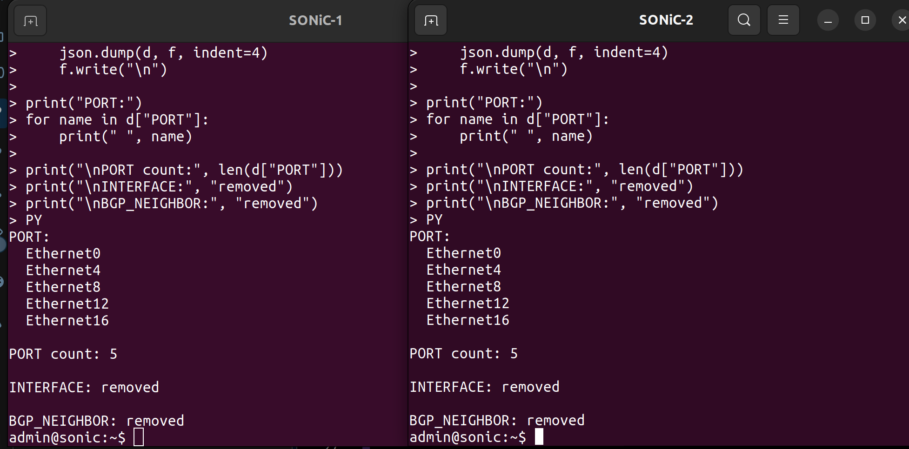
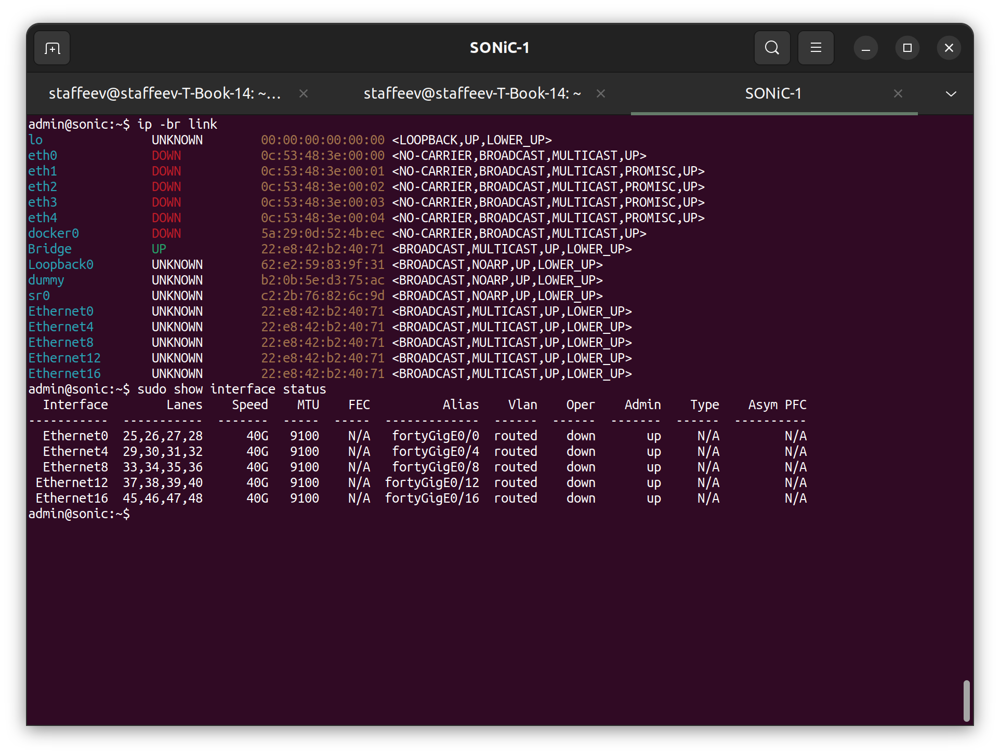
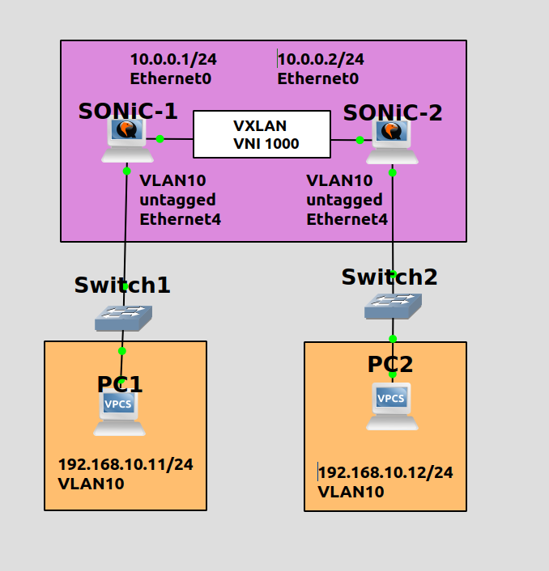
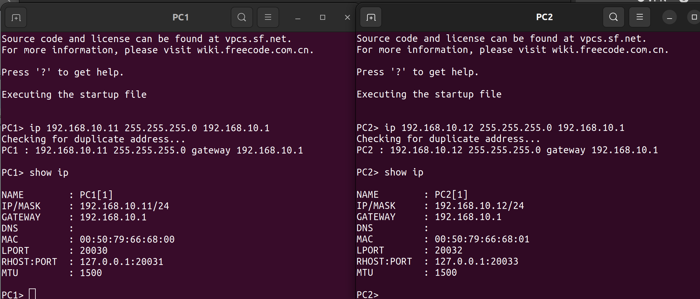
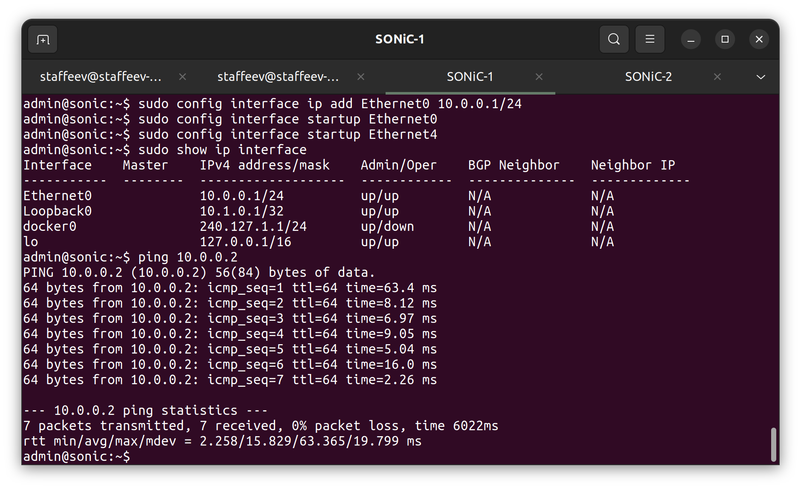
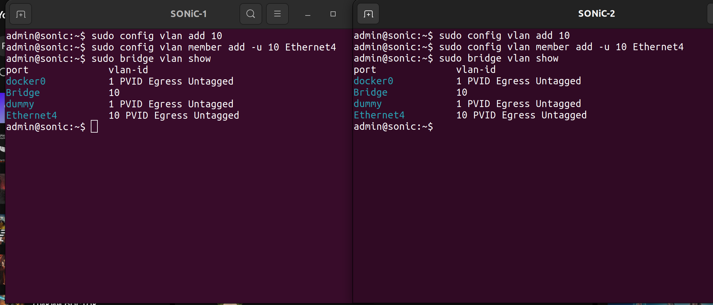
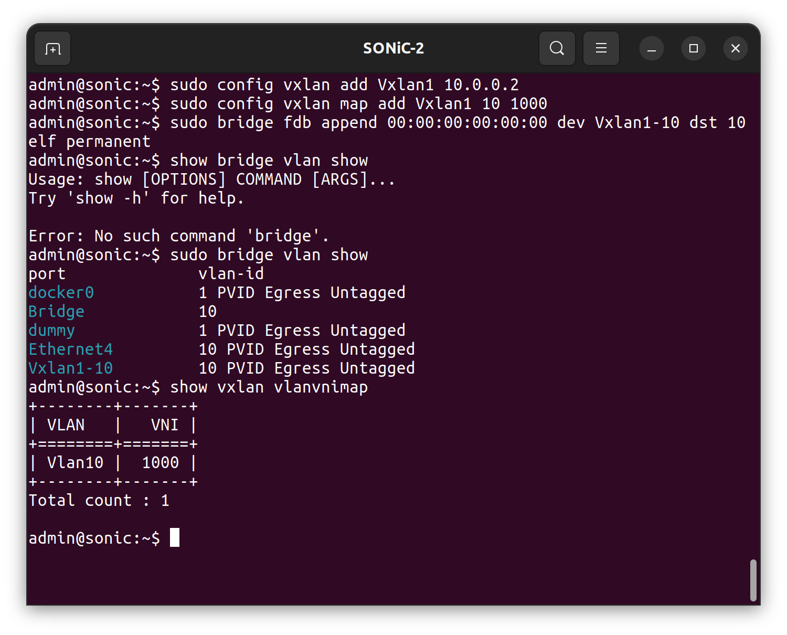
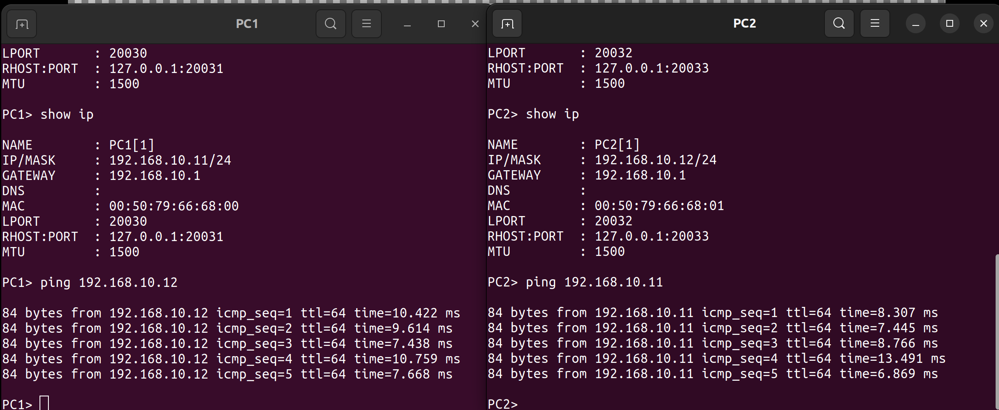

University: ITMO University<br />
Faculty: FICT<br />
Course: Network Functions Virtualization<br />
Year: 2026/2027<br />
Group: K3421<br />
Author: Stafeev Ivan Alekseevich<br />
Lab: Lab3<br />
Date of create: 04.10.2026<br />
Date of finished: 04.10.2026<br />

# Лабораторная работа №3. Настройка VXLAN в GNS3 на базе двух маршрутизаторов SONiC

**Цель работы:** освоить принципы построения и настройки оверлейных сетей на базе технологии VXLAN в среде эмуляции GNS3, а также обеспечить сквозное соединение между изолированными сетевыми сегментами поверх underlay-сети с использованием маршрутизаторов на базе SONiC.

Для достижения цели были поставлены следующие задачи:
1. Создать в среде GNS3 тестовую сетевую топологию, включающую два маршрутизатора SONiC, два коммутатора и два конечных хоста.
2. Выполнить настройку IP-адресации для организации базовой IP-связности между интерфейсами маршрутизаторов.
3. Сконфигурировать VLAN на обоих маршрутизаторах и привязать к ним физические интерфейсы, обращенные к локальным хостам.
4. Настроить VXLAN VTEP, выполнив маппинг VLAN на VNI и указав параметры unicast-инкапсуляции с заданием src и dst IP-адресов.
5. Проверить работоспособность созданного L2-туннеля.

---

# 1. Преднастройка SONiC для удобной работы

Перед выполнением основной части лабораторной работы была выполнена настройка обоих узлов SONiC в разрезе работы с интерфейсами, создаваемыми при загрузке. Изначально SONiC создает большое количество виртуальных интерфейсов, которым при использовании BGP выдаются IP-адреса. Эта настройка занимает много времени, а для выполнения работы не нужна ни динамическая маршрутизация, ни большое количество интерфейсов.

На первом шаге был изменен файл `/usr/share/sonic/device/x86_64-kvm-x86_64-r0/SONIC-VM/port_config.ini` (изначальный вид файла частично показан на рисунке 1).


Через `sudo tee` в файле были оставлены только первые 5 портов, что показано на рисунке 2.


Затем требовалось изменить файл `/etc/sonic/config_db.json`, в котором содержатся настройки, применяемые при загрузке ОС. Был написан Python-скрипт, показанный ниже, который, во-первых, удалял из конфигурации BGP-таблицу, а во-вторых, удалял записи об интерфейсах и оставлял записи только о нужных пяти портах.


```pyton
import json

path = "/etc/sonic/config_db.json"

keep = {
    "Ethernet0",
    "Ethernet4",
    "Ethernet8",
    "Ethernet12",
    "Ethernet16",
}

with open(path) as f:
    d = json.load(f)

d.pop("BGP_NEIGHBOR", None)

ports = d.get("PORT", {})

d["PORT"] = {
    name: value
    for name, value in ports.items()
    if name in keep
}

d.pop("INTERFACE", None)

with open(path, "w") as f:
    json.dump(d, f, indent=4)
    f.write("\n")

print("PORT:")
for name in d["PORT"]:
    print(" ", name)

print("\nPORT count:", len(d["PORT"]))
print("\nINTERFACE:", "removed")
print("\nBGP_NEIGHBOR:", "removed")
```

После выполнения скрипта (рисунки 4 и 5) на обоих маршрутизаторах осталось по 5 портов, что значительно ускорило конфигурацию при старте.





---

# 2. Выполнение лабораторной работы

Схема сети показана на рисунке 6. Указаны необходимые IP-адреса, настраиваемые интерфейсы и некоторые параметры VLAN и VXLAN.



Сначала была произведена простая настройка хостов (рисунок 7). Были заданы адреса `192.168.10.11/24` и `192.168.10.12/24`, и сохранена конфигурация.



На маршрутизаторах SONiC была создана underlay-сеть между ними (рисунок 8, настройка для SONiC-1). Заданы адреса `10.0.0.1/24` и `10.0.0.2/24` на интерфейсах Ethernet0, также они были переведены во включенное состояние. Пинг между устройствами успешно выполнен.



Следующим действием был настроен VLAN 10. На обоих маршрутизаторах был создан VLAN, а порт Ethernet4 установлен в режим untagged, что показано на рисунке 9.



Далее произведена настройка VXLAN, что показано на рисунке 10 для SONiC-2. Создан виртуальный интерфейс Vxlan1 с адресом, совпадающим с Ethernet0, настроен маппинг номера VLAN 10 в VNI 1000. Для добавления пира была создана запись в FDB с помощью команды `sudo bridge fdb append 00:00:00:00:00:00 dev Vxlan1-10 dst 10.0.0.1 self permanent`.



В результате VLAN и VXLAN настроены успешно, что видно по идущему обмену ICMP-пакетами между хостами PC1 и PC2 (рисунок 11).



В выводе команды `tcpdump` видно корректное инкапсулирование пакетов в VXLAN и их передача через underlay-сеть (рисунок 12).


---

# 3. Выводы

В процессе выполнения лабораторной работы были освоены принципы настройки оверлейных сетей VXLAN на маршрутизаторах с ОС `SONiC` в среде `GNS3`. Была создана топология из двух маршрутизаторов, коммутаторов и хостов с организацией базовой IP-связности underlay. Выполнена настройка VLAN, маппинга VLAN на VNI и конфигурация туннельных интерфейсов VTEP. Была успешно подтверждена передача ICMP-пакетов между хостами через созданный L2-туннель. Цель работы выполнена.